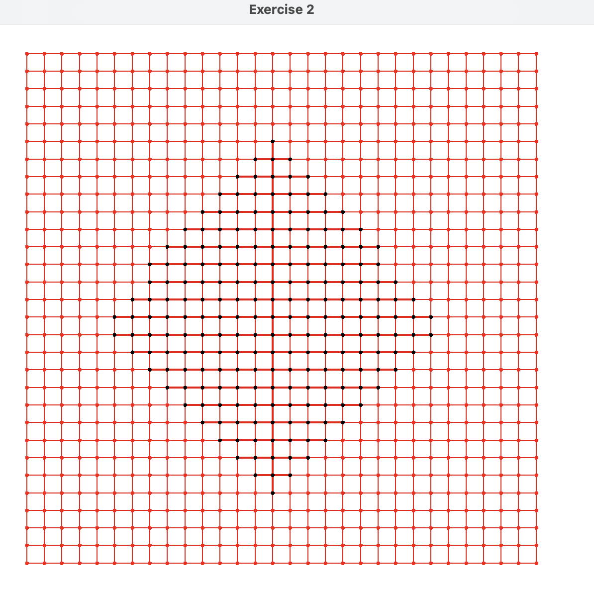

#  Lab 2 Graph Basics: graph traversals

This project implements and visualizes core graph algorithms using the **GraphStream** library in Java.  
It corresponds to **Lab 2: Graph Basics** from the *Interconnection: from dynamic graphs to social networks* course.

---

## Project Structure

```
Interconnection_Lab2/
└── graph-lab2/
    ├── src/
    │   ├── main/
    │   │   ├── java/
    │   │   │   └── pl/uni/graphs/
    │   │   │       ├── App.java
    │   │   │       ├── Tools.java
    │   │   │       └── TraversalAlgorithms.java
    │   │   └── resources/
    │   │       └── dgs/
    │   │           ├── firstgraphlab2.dgs
    │   │           ├── gridvaluated_10_12.dgs
    │   │           ├── gridvaluated_10_220.dgs
    │   │           ├── gridvaluated_30_120.dgs
    │   │           ├── gridvonneumann_30.dgs
    │   │           └── randomgnp_50_0.05.dgs
    ├── screenshots/       
    │   ├── ex1.png
    │   ├── ex2.png
    │   ├── ex3.png
    │   ├── ex4.png
    │   ├── ex5-1.png
    │   ├── ex5-2.png
    │   └── ex6.png
    ├── lab-2-graph-basics.pdf
    ├── README.md
    ├── pom.xml
    └── .gitignore

```

## Main Classes

| Class | Purpose |
|--------|----------|
| `App.java` | Runs all exercises sequentially with visualizations. |
| `Tools.java` | Helper functions for graph reading, styling, and coordinate management. |
| `TraversalAlgorithms.java` | Implements BFS, DFS, Dijkstra, and eccentricity computations. |

---

##  Screenshots


### Exercise 1 – Average Degree


### Exercise 2 – BFS Traversal


### Exercise 3 – DFS Traversal


### Exercise 4 – Dijkstra


### Exercise 5 


### Exercise 6 – BFS vs DFS Spanning Trees


---

## 📄 Lab Instructions

```
lab-2-graph-basics.pdf
```

---

## 👤 Author

Oliwia Witkowska

Cardinal Stefan Wyszyński University (UKSW) 

